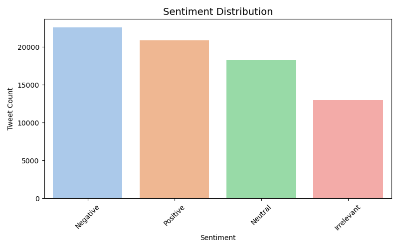
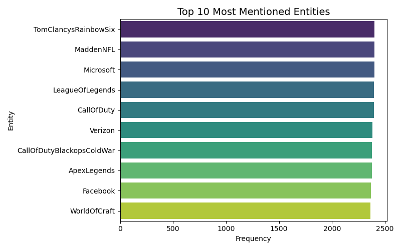

# **PRODIGY_DS_04 - Twitter Sentiment Analysis**

## 📌 Task Overview

This repository contains my fourth task as a **Data Science Intern** at **ProDigy InfoTech**.

**Task**:  
Analyze and visualize **sentiment patterns** in social media (Twitter) data to understand public opinion and attitudes toward specific topics or brands.

**Dataset Source**:  
[Twitter Entity Sentiment Analysis – Kaggle](https://www.kaggle.com/datasets/jp797498e/twitter-entity-sentiment-analysis)

---

## 🧠 Project Description

This project focuses on mining public sentiment from tweets. Using a labeled dataset, the sentiment distribution is analyzed, most talked-about entities are identified, and keywords are visualized using WordClouds for each sentiment category.

---

## 🛠️ Tools & Technologies

- **Python**
- **Pandas** for data handling
- **Seaborn**, **Matplotlib** for visualization
- **WordCloud** for text-based sentiment exploration

---

## 🔍 Steps Performed

1. Data Loading and Preprocessing
2. Sentiment Frequency Analysis
3. Entity Frequency Analysis
4. WordClouds for:
   - Positive Tweets
   - Negative Tweets
   - Neutral Tweets
   - Irrelevant Tweets

---

## 📈 Output Visualizations

- **Sentiment Distribution**  
  

- **Top 10 Entities**  
  

- **WordClouds by Sentiment**  
    
    
    
  

---

## 📚 Key Learnings

- How to analyze social media data
- Basic natural language processing with WordCloud
- Visual interpretation of sentiment trends
- Understanding public opinion around entities/topics

---

## ✅ Conclusion

This project highlights how sentiment analysis can be a powerful tool in social media monitoring, brand management, and customer engagement strategies. The use of visual tools helps reveal patterns and areas of concern or interest among users.

---
